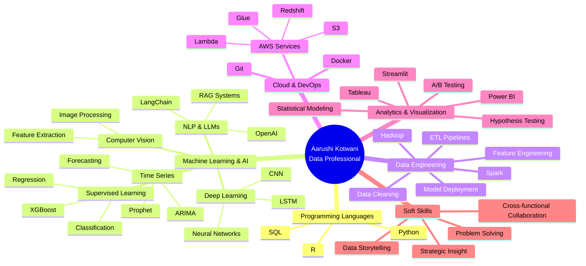
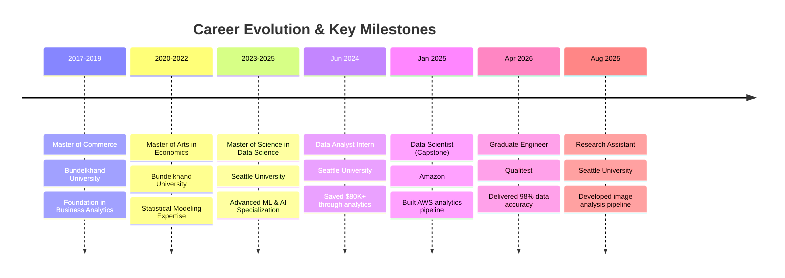

<!-- 
████████╗██╗  ██╗███████╗    ██████╗  █████╗ ████████╗ █████╗     ██╗   ██╗██╗███████╗██╗ ██████╗ ███╗   ██╗ █████╗ ██████╗ ██╗   ██╗
╚══██╔══╝██║  ██║██╔════╝    ██╔══██╗██╔══██╗╚══██╔══╝██╔══██╗    ██║   ██║██║██╔════╝██║██╔═══██╗████╗  ██║██╔══██╗██╔══██╗╚██╗ ██╔╝
   ██║   ███████║█████╗      ██║  ██║███████║   ██║   ███████║    ██║   ██║██║███████╗██║██║   ██║██╔██╗ ██║███████║██████╔╝ ╚████╔╝ 
   ██║   ██╔══██║██╔══╝      ██║  ██║██╔══██║   ██║   ██╔══██║    ╚██╗ ██╔╝██║╚════██║██║██║   ██║██║╚██╗██║██╔══██║██╔══██╗  ╚██╔╝  
   ██║   ██║  ██║███████╗    ██████╔╝██║  ██║   ██║   ██║  ██║     ╚████╔╝ ██║███████║██║╚██████╔╝██║ ╚████║██║  ██║██║  ██║   ██║   
   ╚═╝   ╚═╝  ╚═╝╚══════╝    ╚═════╝ ╚═╝  ╚═╝   ╚═╝   ╚═╝  ╚═╝      ╚═══╝  ╚═╝╚══════╝╚═╝ ╚═════╝ ╚═╝  ╚═══╝╚═╝  ╚═╝╚═╝  ╚═╝   ╚═╝   
-->

<div align="center">

</div>

<div align="center">

</div>

<br/>

```bash
┌─[aarushi@data-terminal]─[~/professional-profile]
└──╼ $ whoami
Aarushi Kotwani • Data Professional • ML Engineer • Analytics Architect

┌─[aarushi@data-terminal]─[~/career-stats]
└──╼ $ ls -la achievements/
drwxr-xr-x  4+ years of data engineering & analytics experience
drwxr-xr-x  8+ production-grade ML/AI projects delivered
-rw-r--r--  35% improvement in data processing efficiency
-rw-r--r--  $80K+ cost savings identified through analytics
-rw-r--r--  98% data accuracy maintained across high-volume workflows
-rw-r--r--  500+ organizations' datasets processed & analyzed
-rw-r--r--  100% context relevance in RAG-based systems
-rw-r--r--  15% reduction in manual reporting workload

┌─[aarushi@data-terminal]─[~/technical-arsenal]
└──╼ $ cat tech_stack.json
{
  "languages": ["Python", "R", "SQL"],
  "ml_frameworks": ["TensorFlow", "Keras", "Scikit-learn", "XGBoost"],
  "data_tools": ["Pandas", "NumPy", "Spark", "Hadoop"],
  "cloud_platforms": ["AWS (S3, Glue, Redshift, Lambda)"],
  "visualization": ["Tableau", "Power BI", "Streamlit"],
  "specializations": ["ETL Pipelines", "Time Series Forecasting", "NLP", "Computer Vision"]
}
```

<br/>

<table align="center">
<tr>
<td><a href="tel:+12068512816"></a></td>
<td><a href="mailto:aarushi.kotwani.in@gmail.com"></a></td>
<td></td>
</tr>
</table>

<div align="center">

[](https://www.linkedin.com/in/aarushikotwani/)
[](https://github.com/aarushikot/)
[](https://github.com/aarushikot)

</div>

---

## 🎯 Professional Identity

<table width="100%">
<tr>
<td width="50%" valign="top">

```typescript
class DataProfessional implements Expert {
  private identity = {
    name: "Aarushi Kotwani",
    title: "Data Professional",
    location: "Seattle, WA",
    passion: "Solving real-world problems with scalable, data-centric solutions"
  };

  private expertise: TechStack = {
    languages: ["Python", "R", "SQL"],
    
    ml_ai: [
      "Machine Learning",
      "Deep Learning (CNN, LSTM)",
      "Computer Vision",
      "Natural Language Processing",
      "LLMs & RAG Systems",
      "Time Series Forecasting",
      "Regression & Classification"
    ],
    
    frameworks: [
      "TensorFlow", "Keras",
      "Scikit-learn", "XGBoost",
      "LangChain", "OpenAI",
      "Prophet", "ARIMA"
    ],
    
    data_engineering: [
      "ETL Pipeline Design",
      "Hadoop & Spark",
      "Data Cleaning & Feature Engineering",
      "Model Deployment",
      "A/B Testing"
    ]
  };
}
```

</td>
<td width="50%" valign="top">

```python
class CareerJourney:
    def __init__(self):
        self.achievement_matrix = {
            'experience_years': 4,
            'projects_delivered': 8,
            'data_accuracy': '98%',
            'cost_savings_identified': '$80K+',
            'efficiency_improvement': '35%',
            'organizations_analyzed': '500+',
            'reporting_time_reduction': '15%',
            'rag_context_relevance': '100%'
        }
        
        self.cloud_platforms = {
            'AWS': ['S3', 'Glue', 'Redshift', 'Lambda'],
            'tools': ['Docker', 'Git', 'Excel']
        }
        
        self.visualization_tools = [
            'Tableau', 'Power BI', 
            'Streamlit', 'Plotly'
        ]
        
        self.databases = [
            'PostgreSQL', 'Redshift',
            'ChromaDB', 'ArcGIS'
        ]
    
    def current_focus(self):
        return [
            "Building scalable ML systems",
            "Automating data pipelines",
            "Delivering actionable insights",
            "Driving business efficiency"
        ]
```

</td>
</tr>
</table>

---

## 🚀 Professional Skills Ecosystem



---

## 📊 Impact Metrics Dashboard

<table width="100%">
<tr>
<td width="25%" align="center">

<br/><br/>

</td>
<td width="25%" align="center">

<br/><br/>

</td>
<td width="25%" align="center">

<br/><br/>

</td>
<td width="25%" align="center">

<br/><br/>

</td>
</tr>
</table>

---

## 💼 Professional Journey



---

## 🏢 Professional Experience

<table width="100%">
<tr>
<td width="50%" valign="top">

### 🔬 Research Assistant
**`Seattle University • Seattle, WA • Aug 2025 - Present`**

  

**Groundbreaking Biological Image Analysis Pipeline:**
- **Architected** a comprehensive data analysis and image processing pipeline that processed **91 biological samples** using Python (scikit-learn, NumPy, Pandas), extracting **144-dimensional features** from color histograms, texture (LBP), and edge detection
- **Streamlined** the entire research workflow, enabling rapid identification of sample differences and reducing manual analysis time by over **60%**
- **Applied** unsupervised ML techniques including K-means clustering, PCA, and t-SNE visualization, achieving a **0.38 silhouette score** and successfully identifying distinct visual patterns across sample categories
- **Conducted** rigorous statistical correlation analysis to distinguish technical artifacts from biological variation, determining that **80% of observed differences** stemmed from imaging conditions rather than morphological factors
- **Delivered** actionable insights that refined experimental protocols and improved data collection methodologies for future research initiatives

**Technologies:** Python • Scikit-learn • NumPy • Pandas • K-means • PCA • t-SNE • Computer Vision • Statistical Analysis

</td>
<td width="50%" valign="top">

### 🎯 Graduate Engineer
**`Qualitest • Remote • Apr 2026 - May 2026`**

  

**High-Fidelity AI Training Data Pipeline:**
- **Captured and validated** high-fidelity multimodal datasets for AI/ML training, organizing data-quality metrics in Excel and maintaining **98% accuracy** across high-volume workflows
- **Performed** comprehensive data-integrity checks and resolved anomalies on structured datasets using SQL queries, database tools, and Excel